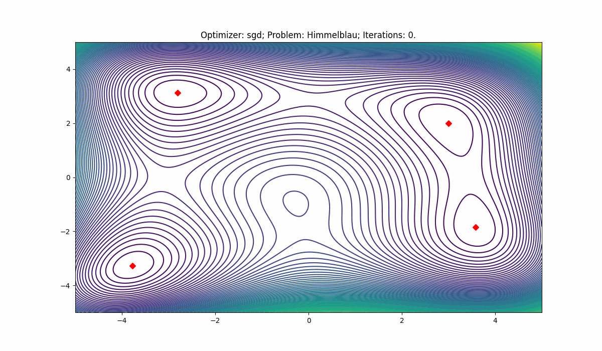

# Toy Problems Demo

## Rosenbrock

The Rosenbrock function is a non-convex function used as a performance test problem for optimization algorithms introduced by Howard H. Rosenbrock in 1960. It is also known as Rosenbrock's valley or Rosenbrock's banana function.

<!-- Rosenbrock function formula -->

## Himmelblau

The Himmelblau function is a multi-modal function used as a performance test problem for optimization algorithms introduced by David B. Himmelblau in 1972. The function is defined by

<!-- Himmelblau function formula -->

Every 10th iteration of SGD (100 iterations in total).

Maximum of 18 iteration were needed to find all four minima for HF.
